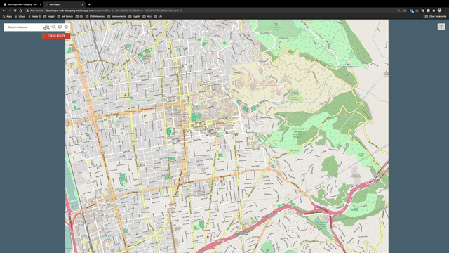
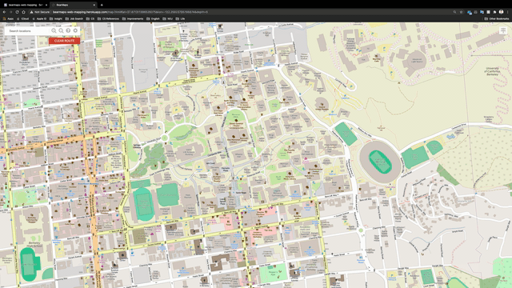

# [WEB MAPPING APPLICATION] (http://bearmaps-web-mapping.herokuapp.com/)

CONTENTS OF THIS FILE
---------------------

 * Introduction
 * Requirements
 * Usage
 * Maintainers
 * Contributing

INTRODUCTION
------------

A Web mapping application for location search, display and optimal route planning.

REQUIREMENTS
------------

This module requires no modules outside of Java.

USAGE
-------------

http://bearmaps-web-mapping.herokuapp.com/

MAINTAINERS
-----------

 * Emiliano Zhu - https://www.linkedin.com/in/emiliano-zhenfang-zhu-587416184/

CONTRIBUTING
-----------

Pull requests are welcome. For major changes, please open an issue first to
discuss what you would like to change.

Please make sure to update tests as appropriate.
